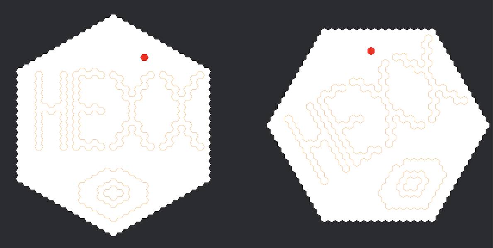
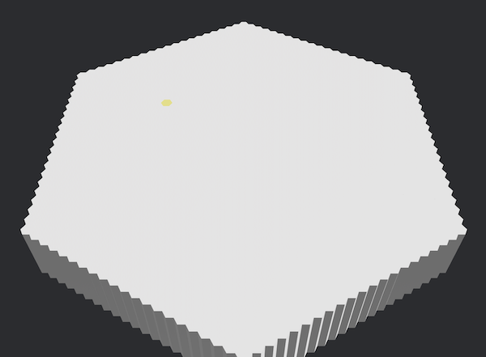
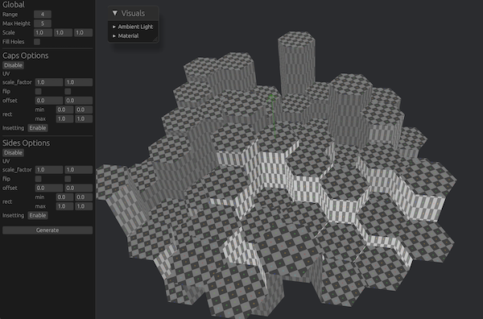
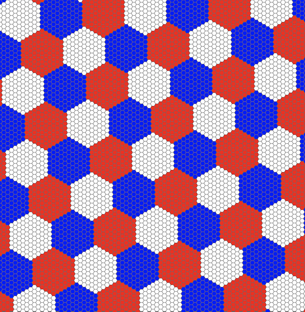
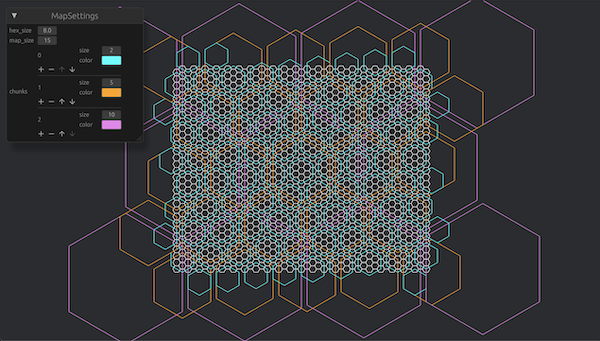
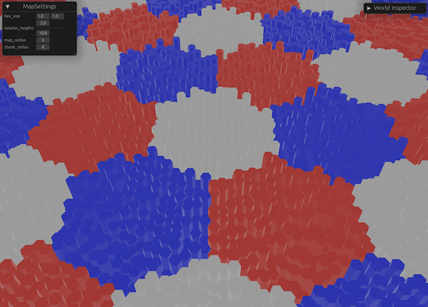
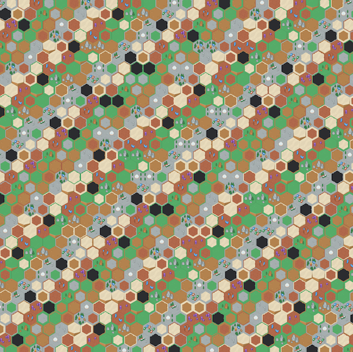

<p align="center">
  
</p>

[](https://github.com/ManevilleF/hexx/actions/workflows/rust.yml)
[](./LICENSE)
[](https://github.com/rust-secure-code/safety-dance/)
[](https://crates.io/crates/hexx)
[](https://crates.io/crates/hexx)
[](https://docs.rs/hexx)
[](https://deps.rs/crate/hexx)

<!-- cargo-sync-readme start -->

 Hexagonal tools lib in rust.

 > Inspired by this [`RedBlobGames` article](https://www.redblobgames.com/grids/hexagons/implementation.html)
 > and [Sander Evers](https://sanderevers.github.io/) work

 This lib allows you to:

 * Manipulate hexagon coordinates
 * Generate hexagonal maps with custom layouts and orientation
 * Generate hexagon meshes (planes or columns)

 I made the choice to use *Axial Coordinates* for performance and utility
 reasons, but the [`Hex`](https://docs.rs/hexx/latest/hexx/hex/struct.Hex.html) type has conversion utilities with
 *cubic*, *doubled*, *hexmod* and *offset* coordinates.

 > See the [hexagonal coordinate systems](https://www.redblobgames.com/grids/hexagons/#coordinates)

 ## Installation

 Run `cargo add hexx` in your project or add the following line to your
 `Cargo.toml`:

 * `hexx = "0.20"`

 ### Cargo features

 `hexx` provides the following cargo features:
 * `serde`: Enables [serde](https://github.com/serde-rs/serde) support for
   most types
 * `packed`: Makes [`Hex`](https://docs.rs/hexx/latest/hexx/hex/struct.Hex.html) `repr(C)`, useful to use it
   accross the FII
 * `bevy_reflect`: Enables [Bevy Reflection](https://docs.rs/bevy_reflect/latest/bevy_reflect)
   for most types. Useful for integration with [Bevy](https://bevyengine.org/)
 * `grid`: Enables support for Face/Vertex/Edge [grid handling](https://www.redblobgames.com/grids/parts/#hexagon-coordinates)
   using `Hex` as Face, `GridVertex` as vertex and `GridEdge` as edge.
 * `algorithms`: Enables the [algorithms](https://docs.rs/hexx/latest/hexx/algorithms/) module with:
   * Field of Movement
   * A Star Pathfinding
   * Field of view
 * `mesh`: Enables procedural mesh generation

 _Some features are enabled by default, it is recommended to enable only
 what is needed for your usage_

 ## Features

 `hexx` provides the [`Hex`](https://docs.rs/hexx/latest/hexx/hex/struct.Hex.html) coordinates with:

 * Distances
 * Neighbors and directions
 * Lines
 * Ranges
 * Rings
 * Edges
 * Wedges
 * Spirals
 * Rotation
 * Symmetry
 * Vector operations
 * Conversions to other coordinate systems:
     * Cubic coordinates
     * Offset coordinates
     * Doubled coordinates
     * Hexmod coordinates
 * Multiple hex resolution

 ## Basic usage

```rust
 use hexx::*;

 // Declare points in hexagonal spaces
 let point_a = hex(10, -5); // Equivalent of `Hex::new(10, -5)`
 let point_b = hex(-8, 15);
 // Find distance between them
 let dist = point_a.unsigned_distance_to(point_b);
 // Compute a line between points
 let line: Vec<Hex> = point_a.line_to(point_b).collect();
 // Compute a ring from `point_a` containing `point_b`
 let ring: Vec<Hex> = point_a.ring(dist).collect();
 // Rotate `point_b` around `point_a` by 2 times 60 degrees clockwise
 let rotated = point_b.rotate_cw_around(point_a, 2);
 // Find the direction between the two points
 let dir_a = point_a.main_direction_to(point_b);
 let dir_b = point_b.main_direction_to(point_a);
 assert!(dir_a == -dir_b);
 // Compute a wedge from `point_a` to `point_b`
 let wedge = point_a.wedge_to(point_b);
 // Get the average value of the wedge
 let avg = wedge.average();
 ```

 ## Layout usage

 [`HexLayout`](https://docs.rs/hexx/latest/hexx/layout/struct.HexLayout.html) is the bridge between your
 world/screen/pixel coordinate system and the hexagonal coordinates system.

```rust
 use hexx::*;

 // Define your layout
 let layout = HexLayout {
     scale: Vec2::new(1.0, 1.0),
     orientation: HexOrientation::Flat,
     ..Default::default()
 };
 // Get the hex coordinate at the world position `world_pos`.
 let world_pos = Vec2::new(53.52, 189.28);
 let point = layout.world_pos_to_hex(world_pos);
 // Get the world position of `point`
 let point = hex(123, 45);
 let world_pos = layout.hex_to_world_pos(point);
 ```

 ## Wrapping

 [`HexBounds`](https://docs.rs/hexx/latest/hexx/bounds/struct.HexBounds.html) defines a bounding hexagon around a
 center coordinate. It can be used for boundary and interesection checks but
 also for wrapping coordinates.
 Coordinate wrapping transform a point outside of the bounds to a point
 inside. This allows for seamless or repeating [wraparound](https://www.redblobgames.com/grids/hexagons/#wraparound)
 maps.

 ```rust
 use hexx::*;

 let center = hex(23, -45);
 let radius = 5;
 let bounds = HexBounds::new(center, radius);
 let outside_coord = hex(12345, 98765);
 assert!(!bounds.is_in_bounds(outside_coord));
 let wrapped_coord = bounds.wrap(outside_coord);
 assert!(bounds.is_in_bounds(wrapped_coord));
 ```

 ## Resolutions and chunks

 [`Hex`](https://docs.rs/hexx/latest/hexx/hex/struct.Hex.html) support multi-resolution coordinates.
 In practice this means that you may convert a coordinate to a different
 resolution:

 * To a lower resolution, meaning retrieving a *parent* coordinate
 * to a higher resolution, meaning retrieving the center *child* coordinate

 Resolutions are abstract, the only useful information is the resolution
 **radius**.

 For example, if you use a big grid, with a radius of a 100, you might want
 to split that grid evenly in larger hexagons containing a 10 radius of
 coordinates and maybe do operations locally inside of these chunks.

 So instead of using a big range directly:

 ```rust
 use hexx::*;

 const MAP_RADIUS: u32 = 100;

 // Our big grid with hundreds of hexagons
 let big_grid = Hex::ZERO.range(MAP_RADIUS);
 ```

 You may define a smaller grid you will then divide to a higher resolution

 ```rust
 use hexx::*;

 const CHUNK_RADIUS: u32 = 10;
 const MAP_RADIUS: u32 = 20;

 let chunks = Hex::ZERO.range(MAP_RADIUS);
 for chunk in chunks {
     // We can retrieve the center of that chunk by increasing the resolution
     let center = chunk.to_higher_res(CHUNK_RADIUS);
     // And retrieve the other coordinates in the chunk
     let children = center.range(CHUNK_RADIUS);
     // We can retrieve the chunk coordinates from any coordinate..
     for coord in children {
         // .. by reducing the resolution
         assert_eq!(coord.to_lower_res(CHUNK_RADIUS), chunk);
     }
 }
 ```

 An other usage could be to draw an infinite hex grid, with different
 resolutions displayed, dynamically changing according to user zoom level.

 ## Dense map storage

 [`Hex`](https://docs.rs/hexx/latest/hexx/hex/struct.Hex.html) implements `Hash`, and most users store hexagonal
 maps in a `HashMap`. But for some cases `hexx` provides *dense storage*
  [collections](https://docs.rs/hexx/latest/hexx/storage/) with more performant accessors:

 - [`HexagonalMap<T>`](https://docs.rs/hexx/latest/hexx/storage/hexagonal/struct.HexagonalMap.html)
 - [`RombusMap<T>`](https://docs.rs/hexx/latest/hexx/storage/rombus/struct.RombusMap.html)

 ## Procedural meshes

 > Requires the `mesh` feature

 `hexx` provides 3 built-in procedural mesh construction utilies:
 - [`PlaneMeshBuilder`](https://docs.rs/hexx/latest/hexx/mesh/plane_builder/struct.PlaneMeshBuilder.html) for
   hexagonal planes
 - [`ColumnMeshBuilder`](https://docs.rs/hexx/latest/hexx/mesh/column_builder/struct.ColumnMeshBuilder.html)  for
   hexagonal columns
 - [`HeightMapMeshBuilder`](https://docs.rs/hexx/latest/hexx/mesh/heightmap_builder/struct.HeightMapMeshBuilder.html)
   for hexagonal height maps

 All those builders have a lot of customization options and will output a
 [`MeshInfo`](https://docs.rs/hexx/latest/hexx/mesh/struct.MeshInfo.html) struct containing vertex positions,
 normals and uvs

 ### Usage in [Bevy](https://bevyengine.org/)

 If you want to integrate the procedural meshes in [bevy](bevyengine.org) you
 may do it this way:

```rust
 use bevy::{
     prelude::Mesh,
     render::{
         mesh::Indices, render_asset::RenderAssetUsages, render_resource::PrimitiveTopology,
     },
 };
 use hexx::MeshInfo;

 pub fn hexagonal_mesh(mesh_info: MeshInfo) -> Mesh {
     Mesh::new(
         PrimitiveTopology::TriangleList,
         // Means you won't interact with the mesh on the CPU afterwards
         // Check bevy docs for more information
         RenderAssetUsages::RENDER_WORLD,
     )
     .with_inserted_attribute(Mesh::ATTRIBUTE_POSITION, mesh_info.vertices)
     .with_inserted_attribute(Mesh::ATTRIBUTE_NORMAL, mesh_info.normals)
     .with_inserted_attribute(Mesh::ATTRIBUTE_UV_0, mesh_info.uvs)
     .with_inserted_indices(Indices::U16(mesh_info.indices))
 }
 ```

<!-- cargo-sync-readme end -->

> See the [examples](examples) for bevy usage

## Q&A

> Why not derive `PartialOrd, Ord` on `Hex` ?

Adding these traits to `Hex` would mean to define an absolute rule on how to solve
this:

```rust
let a = hex(-10, 20);
let b = hex(1, 2);
a > b
```

Depending on how you consider this there are at least 3 possible rules:

* `a.y` is greater than `b.y` so it's `true`
* `a.x` is lower than `b.x` so it's `false`
* `a`'s length is greater than `b`'s so it's `true`

> What if I want to use it in a `BtreeMap`, `BTreeSet` or `BinaryHeap` ?

Use a wrapper with the `Ord` and `PartialOrd` trait. You can copy and paste this
code snippet into your project:

```rust
/// [`Ordering`] wrapper around [`Hex`], comparing [`Hex::y`] then [`Hex::x`].
#[derive(Debug, Clone, Copy, PartialEq, Eq)]
pub struct OrdByYX(pub Hex);

impl Ord for OrdByYX {
    fn cmp(&self, other: &Self) -> Ordering {
        self.0.y.cmp(&other.0.y).then(self.0.x.cmp(&other.0.x))
    }
}

impl PartialOrd for OrdByYX {
    fn partial_cmp(&self, other: &Self) -> Option<Ordering> {
        Some(self.cmp(other))
    }
}
```

## Examples

`hexx` provides interactive examples showcasing various features:

### Hex grid


> `cargo run --example hex_grid`

This example showcases hex ranges, rings, wedges, rotation, and lines

### Hex Area



> `cargo run --example hex_area`

This example showcases how to generate hexagonal areas using grid utilities and gizmos
and how to use two layouts on the same grid.

### Scroll Map


> `cargo run --example scroll_map`

This example showcases the `HexMap` struct for scrolling maps

### Wrap Map


> `cargo run --example wrap_map`

This example showcases the `HexMap` struct for looping/wrapping map

### A Star pathfinding


> `cargo run --example a_star`

This example showcases the A star algorithm, with an interactive pathfinding
between the origin and your cursor. Clicking on tile toggles their availability

### Field of view


> `cargo run --example field_of_view`

This example showcases the FOV algorithm, with an interactive range fov around
your cursor.
Clicking on tile toggles their visibility.

### Field of movement


> `cargo run --example field_of_movement`

This example showcases the field of movement algorithm, interactively displaying
the accessible range of movement around the cursor.

### 3d columns


> `cargo run --example 3d_columns`

This example showcases the 3d hexagon columns procedural generation

### 3d picking



> `cargo run --example 3d_picking`

This example showcases how to use the camera ray to detect hovered 3d columns

### Mesh builder


> `cargo run --example mesh_builder --features bevy_reflect`

This example showcases the hexagon columns procedural generation customization options

### Height Map Mesh builder



> `cargo run --example heightmap_builder --features bevy_reflect`

This example showcases the hexagon 3D height map procedural generation customization options

### Chunks



> `cargo run --example chunks`

This example showcases the hexagon resolution system, allowing to tile coordinates
in evenly sized chunks

### Dynamic resolutions



> `cargo run --example resolutions --feature bevy_reflect`

This example showcases the hexagon resolution system, with multiple configurable
chunk sizes and dynamic visualization

### Merged Chunks



> `cargo run --example merged_columns --features bevy_reflect`

This example showcases how to build a simple hex chunk system with each chunk
being a single mesh

### Sprite Sheet



> `cargo run --example sprite_sheet`

This example showcases how to use hexx with 2D sprite sheet.

### Shapes


> `cargo run --example shapes --features bevy_reflect`

This example showcases how to use hexx shapes module
