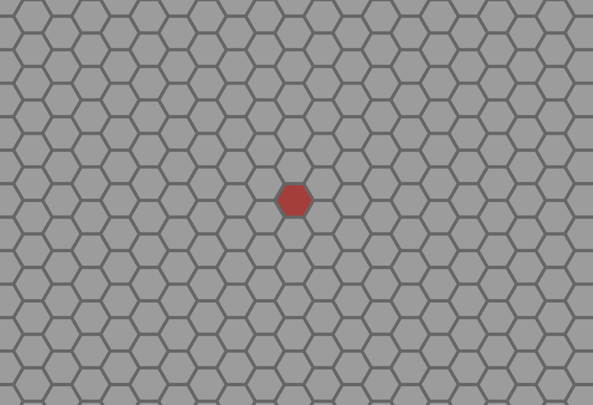

<!-- cargo-sync-readme start -->

 # Hexx

 [](https://github.com/ManevilleF/hexx/actions/workflows/rust.yml)
 [](./LICENSE)
 [](https://github.com/rust-secure-code/safety-dance/)
 [](https://crates.io/crates/hexx)
 [](https://docs.rs/hexx)
 [](https://deps.rs/crate/hexx)

 Hexagonal tools lib in rust.

 > Inspired by this [`RedBlobGames` article](https://www.redblobgames.com/grids/hexagons/implementation.html).

 This lib allows you to:
 - Manipulate hexagon coordinates
 - Generate hexagonal maps with custom layouts and orientation
 - Generate hexagon meshes (planes or columns)

 I made the choice to use *Axial Coordinates* for performance and utility reasons,
 but the `Hex` type allows you to use computes *Cubic coordinates*. (See the [hexagonal coordinate systems](https://www.redblobgames.com/grids/hexagons/#coordinates))

 The `Hex` type gives you access to most hexagonal arithmetics like:
 - Distances
 - Neighbors and directions
 - Lines
 - Ranges
 - Rings
 - Rotation

 ## Example

 

 > `cargo run --example hex_grid`

 ## Usage in bevy

 If you want to generate 3D hexagonal mesh and use it in [bevy](bevyengine.org) you may do it this way:

```rust
 use bevy::prelude::Mesh;
 use bevy::render::{mesh::Indices, render_resource::PrimitiveTopology};
 use hexx::{HexLayout, Hex, MeshInfo};

pub fn hexagonal_plane(hex: Hex, hex_layout: &HexLayout) -> Mesh {
    let mesh_info = MeshInfo::hexagonal_plane(
        hex_layout,
        hex,
    );
    let mut mesh = Mesh::new(PrimitiveTopology::TriangleList);
    mesh.insert_attribute(Mesh::ATTRIBUTE_POSITION, mesh_info.vertices.to_vec());
    mesh.insert_attribute(Mesh::ATTRIBUTE_NORMAL, mesh_info.normals.to_vec());
    mesh.insert_attribute(Mesh::ATTRIBUTE_UV_0, mesh_info.uvs.to_vec());
    mesh.set_indices(Some(Indices::U16(mesh_info.indices)));
    mesh
}
```

<!-- cargo-sync-readme end -->