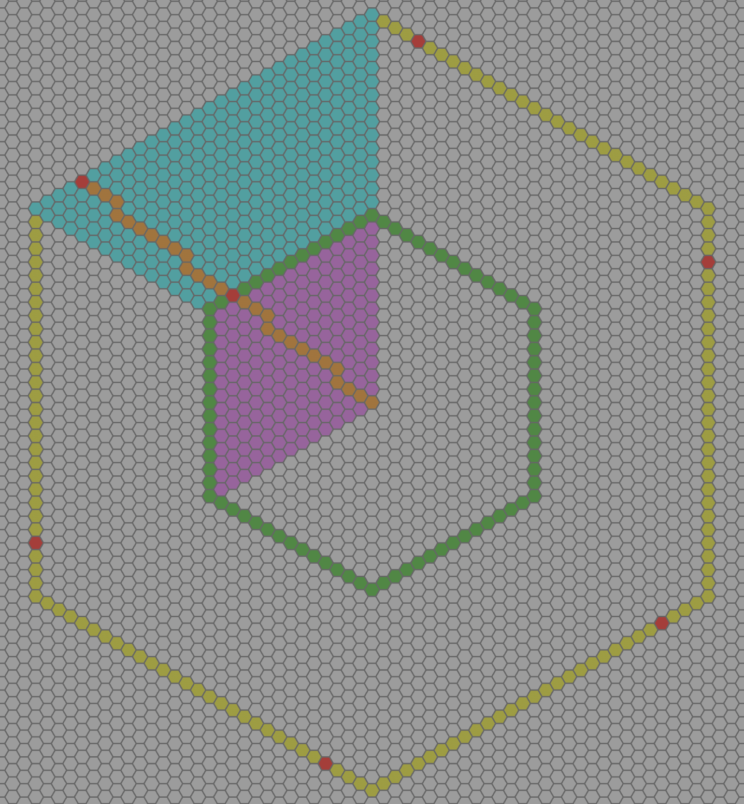
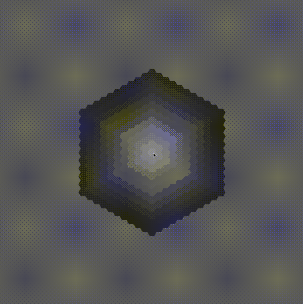
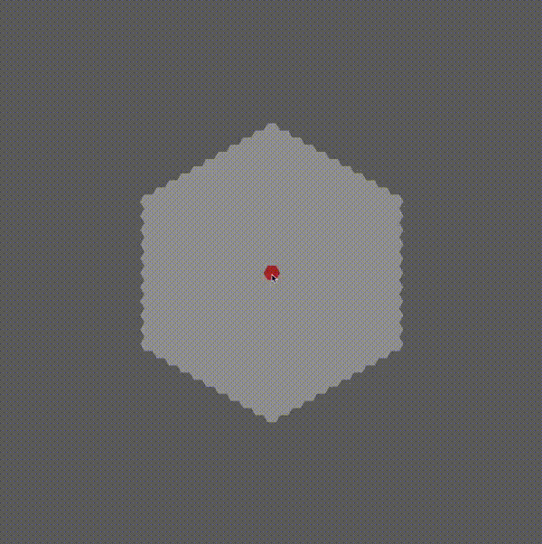
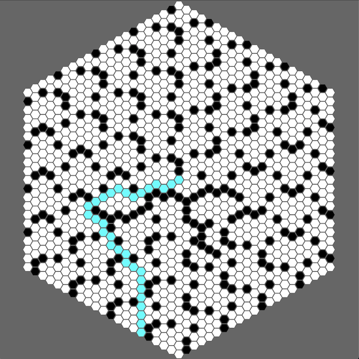
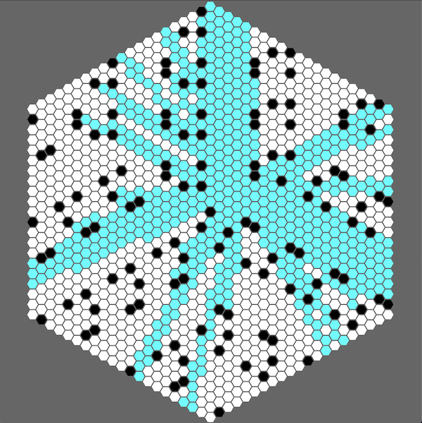
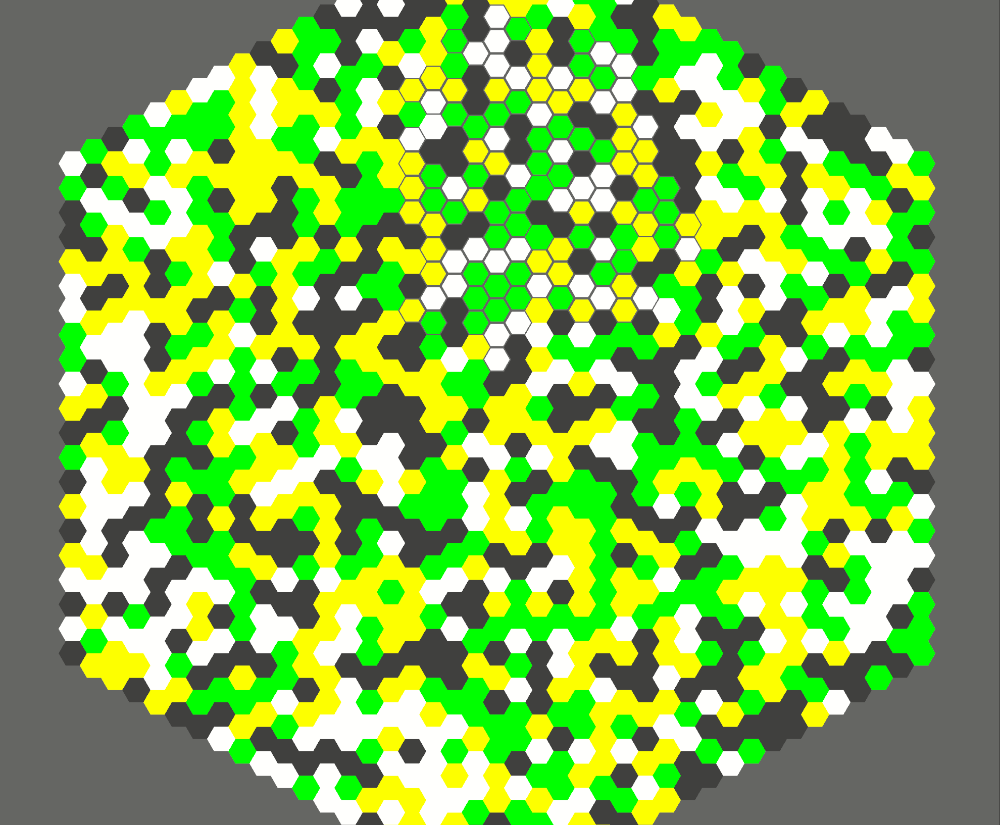
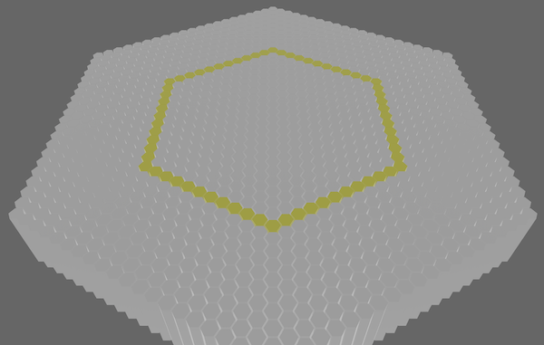
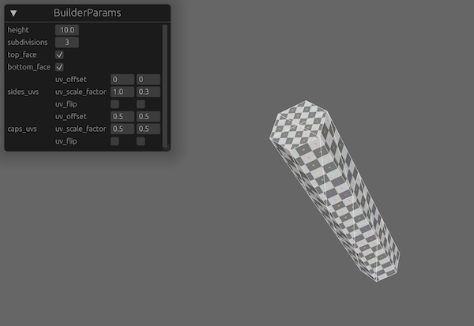

<p align="center">
  
</p>

[](https://github.com/ManevilleF/hexx/actions/workflows/rust.yml)
[](./LICENSE)
[](https://github.com/rust-secure-code/safety-dance/)
[](https://crates.io/crates/hexx)
[](https://docs.rs/hexx)
[](https://deps.rs/crate/hexx)

<!-- cargo-sync-readme start -->

 Hexagonal tools lib in rust.

 > Inspired by this [`RedBlobGames` article](https://www.redblobgames.com/grids/hexagons/implementation.html).

 This lib allows you to:
 - Manipulate hexagon coordinates
 - Generate hexagonal maps with custom layouts and orientation
 - Generate hexagon meshes (planes or columns)

 I made the choice to use *Axial Coordinates* for performance and utility reasons,
 but the [`Hex`] type has conversion utilities with *cubic*, *doubled* and *offset* coordinates.

 > See the [hexagonal coordinate systems](https://www.redblobgames.com/grids/hexagons/#coordinates)

 ## Installation

 Run `cargo add hexx` in your project or add the following line to your `Cargo.toml`:

 - `hexx = "0.6"`

 ### Cargo features

 `hexx` supports serialization and deserialization of most types using [serde](https://github.com/serde-rs/serde),
 through the `ser_de` feature gate. To enable it add the following line to your `Cargo.toml`:

 - `hexx = { version = "0.6", features = ["ser_de"] }`

 By default `Hex` uses rust classic memory layout, if you want to use `hexx` through the FFI or
 have `Hex` be stored without any memory padding, the `packed` feature will make `Hex`
 `repr(C)`. To enable this behaviour add the following line to your `Cargo.toml`:

 - `hexx = { version = "0.6", features = ["packed"] }`

 ## Features

 `hexx` provides the [`Hex`] coordinates with:
 - Distances
 - Neighbors and directions
 - Lines
 - Ranges
 - Rings
 - Edges
 - Wedges
 - Spirals
 - Rotation
 - Symmetry
 - Vector operations
 - Conversions to other coordinate systems

 And the [`HexMap`] utility, for *wraparound* (seamless) hexagonal maps

 ## Basic usage

```rust
 use hexx::*;

 // Declare points in hexagonal spaces
 let point_a = hex(10, -5); // Equivalent of `Hex::new(10, -5)`
 let point_b = hex(-8, 15);
 // Find distance between them
 let dist = point_a.unsigned_distance_to(point_b);
 // Compute a line between points
 let line: Vec<Hex> = point_a.line_to(point_b).collect();
 // Compute a ring from `point_a` containing `point_b`
 let ring: Vec<Hex> = point_a.ring(dist).collect();
 // Rotate `point_b` around `point_a` by 2 times 60 degrees clockwise
 let rotated = point_b.rotate_right_around(point_a, 2);
 // Find the direction between the two points
 let dir_a = point_a.main_direction_to(point_b);
 let dir_b = point_b.main_direction_to(point_a);
 assert!(dir_a == -dir_b);
 // Compute a wedge from `point_a` to `point_b`
 let wedge = point_a.wedge_to(point_b);
 // Get the average value of the wedge
 let avg = wedge.average();
```

 ## Layout usage

 [`HexLayout`] is the bridge between your world/screen/pixel coordinate system and the hexagonal
 coordinates system.

```rust
 use hexx::*;

 // Define your layout
 let layout = HexLayout {
    hex_size: Vec2::new(1.0, 1.0),
    orientation: HexOrientation::flat(),
    ..Default::default()
 };
 // Get the hex coordinate at the world position `world_pos`.
 let world_pos = Vec2::new(53.52, 189.28);
 let point = layout.world_pos_to_hex(world_pos);
 // Get the world position of `point`
 let point = hex(123, 45);
 let world_pos = layout.hex_to_world_pos(point);
```

 ## Usage in [Bevy](https://bevyengine.org/)

 If you want to generate 3D hexagonal mesh and use it in [bevy](bevyengine.org) you may do it this way:

```rust
 use bevy::prelude::Mesh;
 use bevy::render::{mesh::Indices, render_resource::PrimitiveTopology};
 use hexx::MeshInfo;

 pub fn hexagonal_plane(mesh_info: MeshInfo) -> Mesh {
    let mut mesh = Mesh::new(PrimitiveTopology::TriangleList);
    mesh.insert_attribute(Mesh::ATTRIBUTE_POSITION, mesh_info.vertices);
    mesh.insert_attribute(Mesh::ATTRIBUTE_NORMAL, mesh_info.normals);
    mesh.insert_attribute(Mesh::ATTRIBUTE_UV_0, mesh_info.uvs);
    mesh.set_indices(Some(Indices::U16(mesh_info.indices)));
    mesh
 }
```

 The [`MeshInfo`] can be produced from [`PlaneMeshBuilder`] or [`ColumnMeshBuilder`]

<!-- cargo-sync-readme end -->

> See the [examples](examples) for bevy usage

 ## Examples

`hexx` provides interactive examples showcasing various features:

 ### Hex grid



 > `cargo run --example hex_grid`

This example showcases hex ranges, rings, wedges, rotation, and lines

 ### Scroll Map



 > `cargo run --example scroll_map`

 This example showcases the `HexMap` struct for scrolling maps

### Wrap Map



 > `cargo run --example wrap_map`

 This example showcases the `HexMap` struct for looping/wrapping map

### A Star pathfinding



 > `cargo run --example a_star`

 This example showcases the A star algorithm, with an interactive pathfinding between the origin and your cursor.
 Clicking on tile toggles their availability

### Field of view



 > `cargo run --example fov`

 This example showcases the FOV algorithm, with an interactive range fov around your cursor.
 Clicking on tile toggles their visibility.

### Field of movement



 > `cargo run --example field_of_movement`

 This example showcases the field of movement algorithm, interactively displaying the accessible range of movement around the cursor.

### 3d columns



 > `cargo run --example 3d_columns`

 This example showcases the 3d hexagon columns procedural generation

### Mesh builder 



 > `cargo run --example mesh_builder`

 This example showcases the hexagon columns procedural generation customization options
